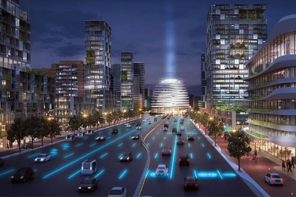

# Assignment1 - Practice Designing Models

> * Participant name: Tiffani Marlowe
> * Project Title: Transportation: Roadways for All

## General Introduction

A **smart city** is an urban area that uses different types of electronic data collection sensors to supply information which is used to manage assets and resources efficiently.

In today’s society, users are becoming ever more dependent on technology and less so on one another. Innovative technologies are changing how people and companies perceive and interact with the real world. Due to better technology, people are now living longer causing city populations to increase, especially in larger cities such as Los Angeles. With cities growing at an exponential rate, the need for better, even smarter, transportation and roadways is apparent. In order to maintain a safe, effective, and traffic free transportation system, the development of a new ecosystem of personal and communal mobility is required.

The automobile has evolved tremendously since 1808 when the first powered car was created. Over the last 200 years, the automobile has transitioned from hydrogen fuel to gasoline fueled and then to electric fueled. What each of these things have in common is the need for a driver. However, in the most recent turn of events in the evolution of the automobile is that this need for a human driver, is quickly dissolving.

The era of so called fully autonomous vehicles is approaching rapidly, and with that comes the potential for less accidents, less traffic, and more efficient roadways. Autonomous vehicles will become the new type of taxi and transportation for all, at least in larger areas; leading to less individually owned vehicles. However, there will still be some individual who prefer to own and drive their own vehicles. Therefore, the need for safer roadways that can accommodate all types of drivers and passengers (manual and autonomous vehicles, buses, trains, bikes, etc.) will be largely important in the success of the smart city.

## Requirements (Experimental Design)

The notion of a Smart City encompasses a variety of definitions and concepts depending on who you talk to and the goal behind the system. For example, a Smart City could mean self-sustaining, ubiquitous, digital, unified, intelligent, etc. For the purpose of this Smart City, I will be referring to a city that is focused on improving daily life of all its inhabitants by making it cleaner and more connected. In particular, with focus on a more efficient, timely, safer, and spatial roadway system for various transportation mechanisms.
Just imagine, a Smart City where:
1)	Vehicle accidents barely ever happen. Autonomous vehicles will be able to account for most, if not all, human error related accidents. There will be less accidents for manual drivers due to less drivers on that portion of the road. 
2)	Traffic is never at a stop. Roadway systems combined with vehicle sensors will allow for less required space and less speed inconsistencies. 
3)	The need for gas will drop due to lesser individually owned vehicles. A vast majority of vehicles will be electric and more environmentally friendly. 
4)	There is less pollution due to more environmentally friendly vehicles and roadways. 
5)	The need for parking spaces and lots will decrease as more people carpool and utilize the autonomous vehicles, leading to more room for other things. 

In order to improve the connection between the city and roadways, and thereby improve liveability, traffic flow, safety, and accessibility, additional space will be needed to create roads that are adjacent to one another. This will help accommodate the variety of vehicles, drivers, and passengers.  Fewer traffic lights and systems will be required, leading to a more constant flow of traffic instead of the continual stop-and-go traffic that consume larger cities today. As seen in the image below:

To ensure that the roadways and transportation are effective, the following requirements must be met:
1)	There must be a separate lane(s) for each vehicle type: Manual driving vehicles, autonomous vehicles, busses, bikes, and subways.
2)	Autonomous vehicles must be equipped with environmental and spatial sensors.
3)	There are designated drop off areas for passengers.
4)	Parking must be available for individually owned vehicles.
5)	Cross walks will be located above the roads in order to prevent vehicles from stopping.

By developing this infrastructure within a simulation, I will be able to test the system, identify any problems beforehand, and determine the minimum amount of transportation needed to meet citizen needs and maintain efficiency. In addition, I can further design the roadway layout in order to maximize performance for drivers, passengers, and pedestrians. In the end, the simulation will further help me perfect the Smart City Roadways.

## Smart City Transportation: Roadways for All Model

This model describes the process behind the Smart Transportation: Roadways for All concept. It is broken down into three main systems, Roadways, Agents, and Vehicles, all which have their own components and variables. The reasoning for breaking it down this way is to better understand each system and how they tie into one another to create a unified system, in this case, the Roadways for All system.

* [**Object Diagram**](model/object_diagram.md)- provides the high level overview of components
* [**Class Diagram**](model/class_diagram.md) - provides details of (what are you providing details of)
* [**Behavior Diagram**](model/behavior_diagram.md) - provides details of (what are you providing details of)
* [**Agent / User case** (if appropriate)](model/agent_usecase_diagram.md) - provides details of (what are you providing details of)

## Smart City (My Problem) Simulation

(remove: for part 3 add two to three sentences here and link the [**(your own name)**](model/README.md) file in the analysis folder - which describe how you would simulate this - type of simulation, rough details -inputs, outputs - how it will help you analyze your experimental hypothesis, or nullify your null hypothesis.)

## Smart City (My Problem) Model
[**Code template**](code/README.md) - Starting coding framework for the (insert your exact problem here.)

## **P**ortable **O**rganic **T**rouble-free **S**elf-watering System (**POTS**) Model
Here [**we provide an overview**](code/POTS_system/README.md) of the **P**ortable **O**rganic **T**rouble-free **S**elf-watering System (**POTS**) Model and provide a source code template.
