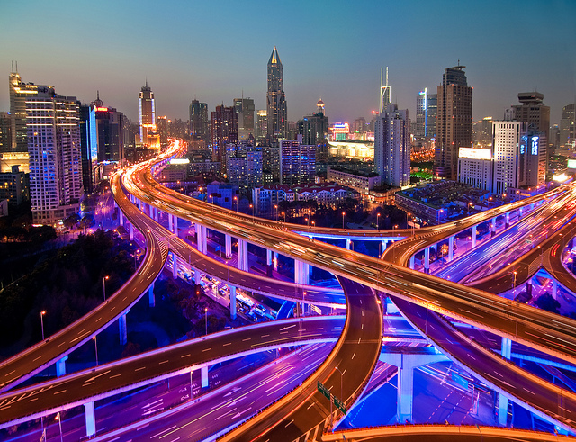
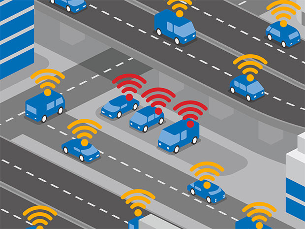

## Smart City Model

Choosing the appropriate simulation was somewhat challenging because my systems involves the need for both agent based monitoring, real-time feedback, and behavior changes in order to account for traffic.

With that being said, I chose a continuous based simulation because my system will need to run at all times of the day. While doing so, it will continually monitor a variety of components such as, vehicle types, sensors, and agents in order to make decisions.

The system will be able to make these decisions using the sensors within the vehicles. The sensors will alert the system whether they are autonomous or manual, in addition to what type of vehicle they are (bus, bike, car, subway). Once the system has verified which lane is appropriate for that vehicle, the system will direct the vehicle to the correct and designated lane. This will all be within seconds.

The Transportation: Roadways for All system will collect data related to:
* Vehicle type: this will help determine if there are more autonomous vehicles than manual vehicles. This will later help adjust roadways and parking.
* Traffic related to time of day: the system would later adjust to these daily changes to better accommodate citizens.
* Environmental sensors: this would be used to determine how various cars effect the city as a whole.

Inputs Variables:
* Vehicle type
* Time of day
* Vehicle location
* Sensor location

Outputs Variables:
* Commute time
* Road congestion
* Parking
* Traffic
* Accidents

To gain insight into this system and its process see images below.

Image 1: Illustrates divided lanes for smoother traffic

Image Source: https://readwrite.com/2017/10/06/smart-data-exchange-smart-city/

Image 2: Illustrates vehicle with sensors.

Image source: https://spectrum.ieee.org/cars-that-think/transportation/efficiency/imagine-new-york-city-with-only-3000-minivans-instead-of-taxis-it-could-work

With the use of this simulation, I can determine if the Transportation: Roadways for All would be effective and if so, how effective. In addition, I would be able to determine where more work needs to be done to continually improve the system and daily lives of the citizens

