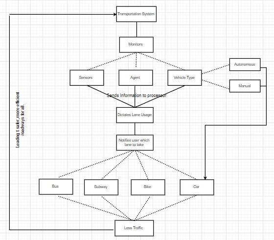

This behavior diagram demonstrates the systems process in terms of communication and interaction between varying components. 

As you can see, the diagram begins with the "transportation system" because it encompasses all aspects of the model. This includes the sensors, vehicles, and agents. All which tie into one another and determine the appropriate route per vehicle or user. Leading to an overall safer and more efficient roadway system.