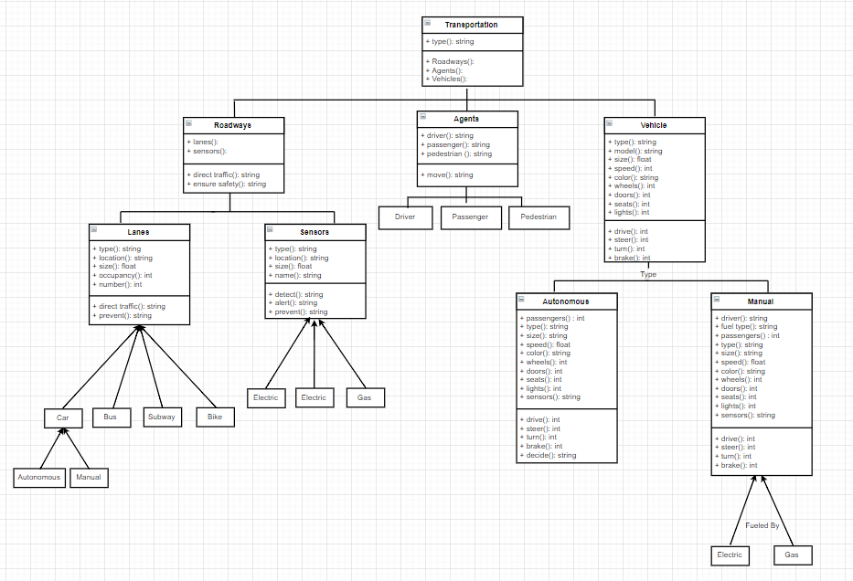

This class diagram is meant to provide a deeper insight into the attributes and functions of the Transportation: Roadways for All system.

This model focuses mainly on the three components: Roadways, Agents, and Vehicles. The purpose behind this was to emphasize the attributes and functions of the larger, more impactful components of the system. This will help prioritize the information when creating the simulation. In addition, it illustrates how certain attributes have the same functions but are applied throughout a different component of the system.