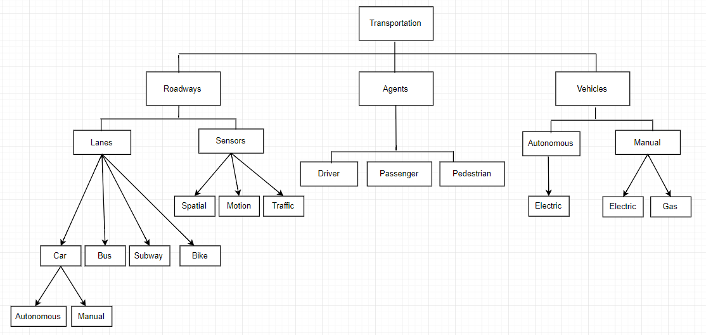

## Smart City (My Problem) Model - Object Diagram

This model describes the process behind the Smart Transportation: Roadways for All concept. It is broken down into three main systems, Roadways, Agents, and Vehicles, all which have their own components and variables. The reasoning for breaking it down this way is to better understand each system and how they tie into one another to create a unified system, in this case, the Roadways for All system.

Roadways encompasses two main variables, Lanes and Sensors. Lanes describes the types of varying lanes involved, and further the type of car that will be using those lanes. While Sensors describes the types of sensors that will be used throughout the entire system, spatial, motion, and traffic. These can be located on street lights, cars, etc. Agents entails the types of people that will be using this system, Drivers, Passengers, and Pedestrians. While lastly, Vehicles describes the type of car that will be using the roadways, autonomous or manual. It then further details what type of fuel they’ll run on, electric or gas. This is meant to shed light on the environmentally friendly vehicles and the safety impact they have on the Smart City over time.